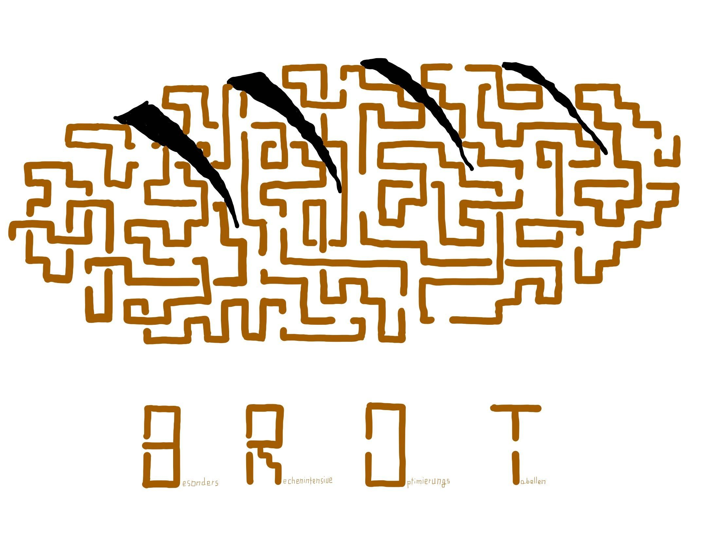

# brot-server

This project contains a server program to emulate the official test environment found unter `wss://msoll.de/spe_ed`.

## Installation
This program uses the gorilla/websocket library that can be found under [https://github.com/gorilla/websocket](https://github.com/gorilla/websocket).

To install the library, run `go get github.com/gorilla/websocket`. 

## Running the server
To build the server, run `go build .`

To run the server, run `./server`

