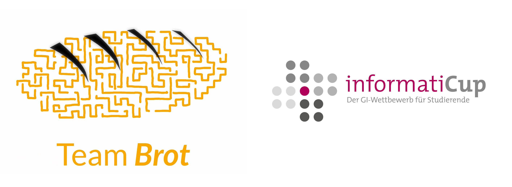

# Brot-Server

## Description

This project contains a server program to emulate the official test environment found unter `wss://msoll.de/spe_ed`. It provides the standard WebSocket game API (`/spe_ed`) as well as the time API (`/spe_ed_time`). It creates a web server that hosts a GUI visualizing the game. The GUI can be accessed under `http://localhost:8080`. 

The server supports one game at a time. It does not check the client's responses for timeouts. Therefore, it should only be used in development.

## Installation

### 0. Prerequisites

Our software is written in Go. So you need a fully functional Go installation. At least version 1.15 is required. You can get information on how to install Go on your computer [here](https://golang.org/doc/install). 

This program also uses the gorilla/websocket library that can be found under [https://github.com/gorilla/websocket](https://github.com/gorilla/websocket).

To install the library, run `go get github.com/gorilla/websocket` after you installed Go.

### 1. Cloning the repository

To clone the repository run `git clone https://github.com/TeamBrot/server.git`. If you'd like to use the scripts we provide with our client, make sure to clone the repository into the same directory. To get into the repository run `cd server`

### 2. Building the server

Run `go build` at the root level of the repository. In case of failure make sure you are in the right directory and your Go installation works.

### 3. Running the server

Run `./server`. The server is now waiting for connections. After the specified number of players connected, a game starts. You can stop the server by pressing <kbd>Strg</kbd>+<kbd>c</kbd> on your keyboard. For information about the options read the section [Configuration](configuration).

If you are also setting up our client you can now jump back [here](https://github.com/TeamBrot/client/blob/master/README.md#4-running-the-client).

## Configuration

The server has several configuration options:

- `-h height`: Board height
- `-w width`: Board width
- `-p player`: Number of players (up to 6)
- `-d minimalDeadline`: Minimal deadline in seconds
- `-o deadlineOffset`: Maximum deadline offset in seconds; maximum deadline is `minimalDeadline + deadlineOffset`. The deadline will be chosen at random.

